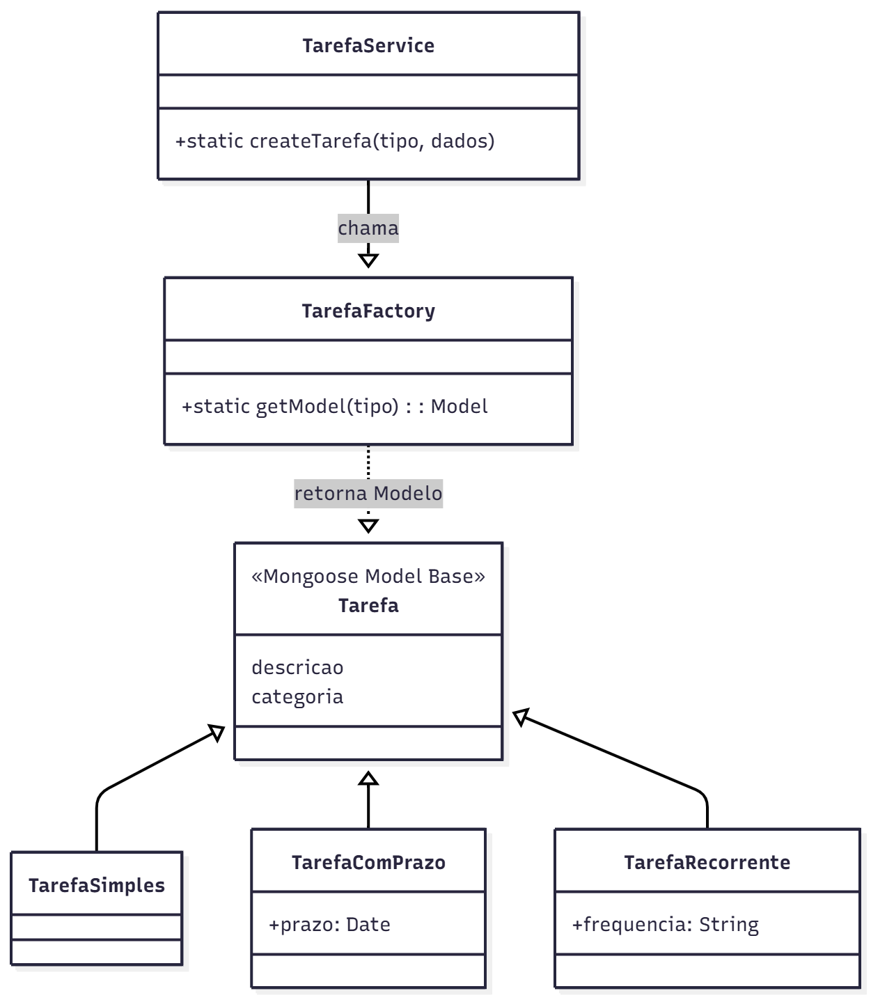
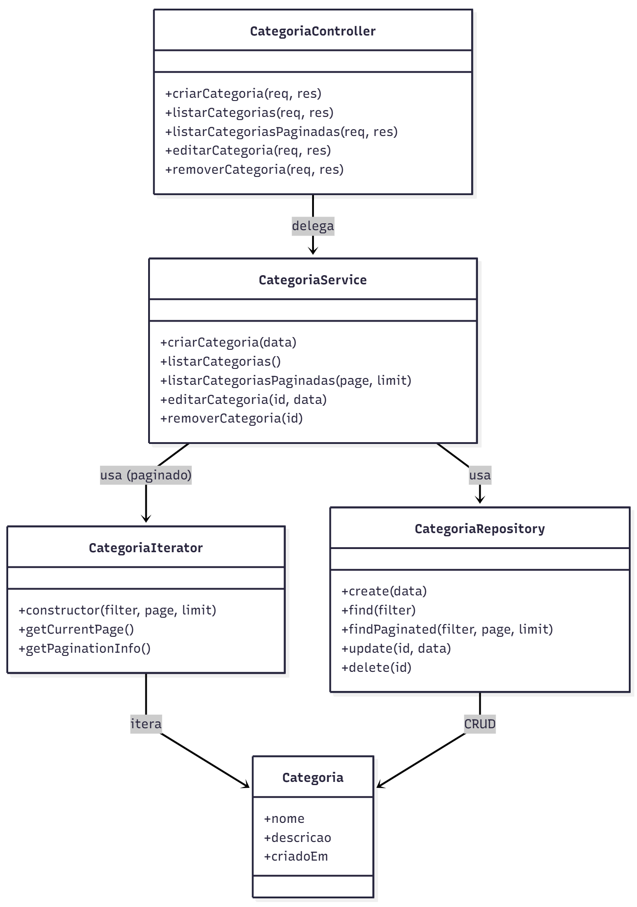
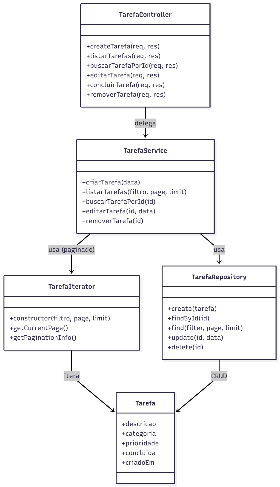

# 3.1.2.1. Padrão GOF: Factory Method

## 1. Introdução

O Factory Method é um padrão de projeto criacional que tem como principal
objetivo delegar a responsabilidade de criação de objetos para subclasses,
permitindo que o código cliente não dependa diretamente de classes concretas.

A intenção central do Factory Method é encapsular a lógica de criação dos
objetos, promovendo flexibilidade e extensibilidade no sistema. Dessa forma, é
possível adicionar novas implementações sem modificar o código existente, em
conformidade com o Princípio Aberto/Fechado (OCP) dos princípios SOLID (GAMMA et
al., 1995).

No contexto do projeto, o padrão Factory Method foi aplicado para centralizar e
padronizar a criação de Tarefas e Categorias, garantindo que todas as regras de
negócio e validações sejam executadas no momento da instância. Essa abordagem
reduz duplicidade de código, facilita a manutenção e torna o sistema mais seguro
e escalável.

Além disso, essa aplicação foi realizada com base na User Story US07 — Criar
listas/categorias, que exigia a implementação de uma forma consistente e
validada de criar categorias dentro do sistema. O uso do Factory Method atendeu
perfeitamente a essa necessidade, assegurando a criação padronizada de objetos
conforme as regras de negócio da história de usuário.

---

## 2. Metodologia

A implementação do padrão seguiu um processo estruturado, dividido nas seguintes
etapas:

1. **Análise das entidades:**
   Foram identificadas as entidades
   [Tarefa e Categoria](https://unbarqdsw2025-2-turma02.github.io/2025.2_T02_G1_OquePlanejoFazer_Entrega_02/#/Modelagem/2.5.1.ElicitacaoRequisitos)
   como candidatas para a aplicação do Factory Method, devido à necessidade de
   regras específicas no momento da criação (ex: nomes únicos, cores válidas,
   limites de categorias).

2. **Modelagem da solução:**
   Foram criados factories específicos para cada entidade, encapsulando a lógica
   de criação e validação dos objetos.

3. **Implementação:**
   Os factories foram implementados em módulos separados e utilizados pelos
   controllers de Tarefa e Categorias e services, assegurando consistência na
   criação de instâncias em todo o sistema.

4. **Testes:**
   Foram realizados testes unitários para validar a criação de tarefas e
   categorias, testando cenários de sucesso e falha, para isso foi utilizado o
   [Insomnia](https://insomnia.rest/).

---

## 3. Participação, Colaboração e Senso Crítico

| Matrícula  | Aluno           |
| ---------- | --------------- |
| 19/0085045 | Brenno Oliveira |
| 20/0024787 | Mateus Siqueira |

O desenvolvimento do código e a aplicação do padrão Factory Method foram
realizados de forma colaborativa pela dupla Brenno Oliveira e Mateus Siqueira,
por meio de videochamadas realizadas pela plataforma `Google Meet`.

Durante as reuniões, foi analisada as necessidades do projeto, dividiu as
tarefas de implementação e realizou revisões e implementações conjuntas de
código, garantindo clareza, colaboração e entendimento do trabalho. O trabalho
em equipe foi essencial para discutir cenários, revisar código e validar as
decisões.

A utilização do Factory Method trouxe organização, segurança e clareza ao
processo de criação das entidades Tarefa e Categorias, trazendo boas práticas de
arquitetura para o projeto "O que planejo fazer".

---

## 4. Justificativa da Decisão Arquitetural

A decisão de aplicar o padrão Factory Method foi motivada pelos seguintes
fatores:

- **Organização e centralização da lógica de criação:** evita duplicação de
  código e mantém a consistência nas regras de negócio.
- **Facilidade de manutenção:** novas regras ou tipos de tarefas/categorias
  podem ser adicionados sem alterar o restante do sistema.
- **Escalabilidade e extensibilidade:** o sistema pode evoluir com o tempo,
  recebendo novas variações de entidades.
- **Flexibilidade para futuras integrações:** a estrutura permite introduzir
  novas classes concretas sem impactar os módulos existentes.
- **Atendimento direto à US07:** o Factory Method garantiu uma boa implementação
  para a criação de categorias, conforme especificado na
  [US07 - Criar listas/categorias](https://unbarqdsw2025-2-turma02.github.io/2025.2_T02_G1_OquePlanejoFazer_Entrega_02/#/Modelagem/2.5.2.DeclaracaoRequisitos).

Em resumo, a aplicação da arquitetura pode aumentar a robustez arquitetural e
garantir melhor isolamento entre camadas, mantendo o código mais limpo, testável
e sustentável.

---

## 5. Modelagem do Factory



O diagrama acima representa a estrutura utilizada para criação e validação das
entidade `Tarefa` utilizando o padrão Factory Method. A entidade `Categoria`
teria uma lógica semelhante.

### 5.1 Modelagem Geral das Entidades

Abaixo segue os diagramas gerais:

## 

## 

## 6. Informações Técnicas e Implementação

### 6.1 Tecnologias Utilizadas

- **JavaScript**
- **Node.js**
- **Mongoose** (para persistência no MongoDB)
- **Insomnia/Postman** (para testes)

### 6.2 Estrutura da Implementação

#### 6.2.1. Factory de Categoria

- **Factory de Categoria:** responsável por criar e validar categorias,
  garantindo nome único e cor válida.

```javascript
const categoriasPadrao = [
  { nome: 'Trabalho', cor: '#FF5733' },
  { nome: 'Pessoal', cor: '#33FF57' },
  { nome: 'Saúde', cor: '#3357FF' },
  { nome: 'Estudos', cor: '#F3FF33' }
];

class CategoriaFactory {
  constructor() {
    this.categorias = [...categoriasPadrao];
    this.coresUsadas = new Set(this.categorias.map(c => c.cor));
  }

  criarCategoria(nome, cor) {
    if (this.categorias.length >= 20) throw new Error('Limite de categorias atingido.');
    if (nome.length < 3 || nome.length > 30) throw new Error('Nome inválido.');
    if (this.coresUsadas.has(cor)) throw new Error('Cor já utilizada.');
    this.categorias.push({ nome, cor });
    this.coresUsadas.add(cor);
    return { nome, cor };
  }

  getCategorias() {
    return this.categorias;
  }
}

export default new CategoriaFactory();
```

#### 6.2.2. Factory de Tarefa

- **Factory de Tarefa:** controla a criação de tarefas simples, com prazo e
  recorrentes, aplicando as regras de negócio pertinentes.

```javascript
// Arquivo: factories/TarefaFactory.js (Versão Discriminator)

// Importamos todos os modelos que o Mongoose nos deu
import { TarefaSimples, TarefaComPrazo, TarefaRecorrente } from '../../models/Tarefa.js';

class TarefaFactory {
  /**
   * Retorna o Modelo Mongoose apropriado com base no tipo.
   * @param {string} tipo - O tipo da tarefa (ex: 'comPrazo').
   * @returns {mongoose.Model} O construtor do modelo Mongoose.
   */
  static getModel(tipo) {
    switch (tipo) {
      case 'comPrazo':
        return TarefaComPrazo;
      case 'recorrente':
        return TarefaRecorrente;
      case 'simples':
      default:
        return TarefaSimples;
    }
  }
}

export default TarefaFactory;
```

#### 6.2.3. Utilização nos Controllers

- **Controllers:** utilizam os factories para criar instâncias padronizadas e
  seguras, garantindo a integridade do sistema.

##### Controller Categoria

```javascript

import CategoriaService from '../services/CategoriaService.js';

class CategoriaController {
  async criarCategoria(req, res) {
    try {
      const { nome, cor } = req.body;
      if (!nome || !cor) {
        return res.status(400).json({ error: 'Nome e cor da categoria são obrigatórios' });
      }
      const categoria = await CategoriaService.criarCategoria(nome, cor);
      res.status(201).json({ message: 'Categoria criada com sucesso', categoria });
    } catch (error) {
      res.status(400).json({ error: error.message });
    }
  }

  async listarCategorias(req, res) {
    try {
      const categorias = await CategoriaService.listarCategorias();
      res.json({ message: 'Categorias listadas com sucesso', categorias });
    } catch (error) {
      res.status(500).json({ error: 'Erro interno do servidor' });
    }
  }

  async listarCategoriasPaginadas(req, res) {
    try {
      const { page = 1, limit = 5 } = req.query;
      const result = await CategoriaService.listarCategoriasPaginadas(Number(page), Number(limit));
      res.json(result);
    } catch (error) {
      res.status(500).json({ error: 'Erro interno do servidor' });
    }
  }

  async editarCategoria(req, res) {
    try {
      const { id } = req.params;
      const { nome } = req.body;
      const categoria = await CategoriaService.editarCategoria(id, nome);
      res.json({ message: 'Categoria editada com sucesso', categoria });
    } catch (error) {
      res.status(400).json({ error: error.message });
    }
  }

  async removerCategoria(req, res) {
    try {
      const { id } = req.params;
      const categoria = await CategoriaService.removerCategoria(id);
      res.json({ message: 'Categoria removida com sucesso', categoria });
    } catch (error) {
      res.status(400).json({ error: error.message });
    }
  }
}

export default CategoriaController;
```

##### Controller Tarefa

```javascript

import TarefaService from '../services/TarefaService.js';

const service = new TarefaService();

class TarefaController {
  static async createTarefa(req, res) {
    try {
      const tarefa = await service.criarTarefa(req.body);
      res.status(201).json({ message: 'Tarefa criada com sucesso', tarefa });
    } catch (error) {
      console.error('Erro ao criar tarefa:', error);
      res.status(500).json({ error: 'Erro interno do servidor', details: error.message });
    }
  }

  static async listarTarefas(req, res) {
    try {
      const { tipo, concluida, prioridade, categoria, page, limit } = req.query;
      let filtro = {};
      if (tipo) filtro.tipo = tipo;
      if (concluida !== undefined) filtro.concluida = concluida === 'true';
      if (prioridade) filtro.prioridade = prioridade;
      if (categoria) filtro.categoria = categoria;
      const result = await service.listarTarefas(filtro, page, limit);
      res.json({ message: 'Tarefas listadas com sucesso', ...result });
    } catch (error) {
      console.error('Erro ao listar tarefas:', error);
      res.status(500).json({ error: 'Erro interno do servidor' });
    }
  }

  static async buscarTarefaPorId(req, res) {
    try {
      const { id } = req.params;
      const tarefa = await service.buscarTarefaPorId(id);
      if (!tarefa) {
        return res.status(404).json({ error: 'Tarefa não encontrada' });
      }
      res.json({ message: 'Tarefa encontrada', tarefa });
    } catch (error) {
      console.error('Erro ao buscar tarefa:', error);
      res.status(500).json({ error: 'Erro interno do servidor' });
    }
  }

  static async editarTarefa(req, res) {
    try {
      const { id } = req.params;
      const tarefa = await service.editarTarefa(id, req.body);
      if (!tarefa) {
        return res.status(404).json({ error: 'Tarefa não encontrada' });
      }
      res.json({ message: 'Tarefa editada com sucesso', tarefa });
    } catch (error) {
      console.error('Erro ao editar tarefa:', error);
      res.status(500).json({ error: 'Erro interno do servidor' });
    }
  }

  static async concluirTarefa(req, res) {
    try {
      const { id } = req.params;
      const tarefa = await service.editarTarefa(id, { concluida: true });
      if (!tarefa) {
        return res.status(404).json({ error: 'Tarefa não encontrada' });
      }
      res.json({ message: 'Tarefa concluída com sucesso', tarefa });
    } catch (error) {
      console.error('Erro ao concluir tarefa:', error);
      res.status(500).json({ error: 'Erro interno do servidor' });
    }
  }

  static async removerTarefa(req, res) {
    try {
      const { id } = req.params;
      const tarefaRemovida = await service.removerTarefa(id);
      if (!tarefaRemovida) {
        return res.status(404).json({ error: 'Tarefa não encontrada' });
      }
      res.json({ message: 'Tarefa removida com sucesso', tarefaRemovida });
    } catch (error) {
      console.error('Erro ao remover tarefa:', error);
      res.status(500).json({ error: 'Erro interno do servidor' });
    }
  }
}

export default TarefaController;
```

---

## 7. Como Executar a Implementação

### 7.1 Pré-requisitos

- Node.js instalado
- MongoDB rodando localmente ou em nuvem
- Executar `npm install` para instalar as dependências

### 7.2 Passos para Execução

1. Clone o repositório:
   ```bash
   git clone https://github.com/UnBArqDsw2025-2-Turma02/2025.2_T02_G1_OquePlanejoFazer_Entrega_03.git
   git checkout feat/listar_tarefas
   ```

2. Inicie o servidor:
   ```bash
   cd backend
   npm start
   ```

3. Teste as rotas de criação:
   ```
   POST/api/categorias
   POST/api/tarefas/simples
   ```

## 8. Video da Execução do Código

<video width="800" controls>
  <source src="assets/explicacao.mp4" type="video/mp4">
  Seu navegador não suporta a tag de vídeo.
</video>

_Vídeo explicativo demonstrando a implementação e execução do padrão Factory
Method no projeto._

## 9. Conclusões da Implementação

A utilização do padrão Factory Method pareceu uma boa escolha para o projeto,
especialmente em casos onde há necessidade de controle sobre a criação de
objetos.

A aplicação truxe um código mais limpo, sustentável e fácil de evoluir,
reforçando o valor da arquitetura dos padrões de projetos e da colaboração no
desenvolvimento de sistemas.

Além disso, a implementação focou na
[US07 - Criar listas/categorias](https://unbarqdsw2025-2-turma02.github.io/2025.2_T02_G1_OquePlanejoFazer_Entrega_02/#/Modelagem/2.5.2.DeclaracaoRequisitos),
proporcionando uma boa base e reutilização para a criação de novas
funcionalidades relacionadas a categorias dentro do sistema.

## Referências Bibliográficas

> SERRANO, Milene. Arquitetura e Desenho de Software - Aula GoFs Criacionais.
> Universidade de Brasília (UnB), Campus Gama. [Material de Aula].

> REFACTORING.GURU. Padrões de Projeto. Disponível em:
> https://refactoring.guru/pt-br/design-patterns. Acesso em: 22 de outubro
> de 2025.

> GAMMA, E. et al. Padrões de Projeto: Soluções Reutilizáveis de Software
> Orientado a Objetos. Porto Alegre: Bookman, 1995.

## Histórico de Versões

| Versão | Alteração                                  | Responsável                                          | Data       | Revisor                                                                | Detalhes da Revisão                     | Data da Revisão |
| ------ | ------------------------------------------ | ---------------------------------------------------- | ---------- | ---------------------------------------------------------------------- | --------------------------------------- | --------------- |
| 1.0    | Criação inicial da página                  | [Brenno Oliveira](https://github.com/Brenno-Silva01) | 23/10/2025 | [Mateus Siqueira](https://github.com/siqueira-prog)                    | Revisão ortográfica e ajustes no layout | 23/10/2025      |
| 1.1    | Adição da metódologia e senso crítico      | [Brenno Oliveira](https://github.com/Brenno-Silva01) | 23/10/2025 | [Mateus Siqueira](https://github.com/https://github.com/siqueira-prog) | revisado, sem alterações                | 23/10/2025      |
| 1.2    | Adição do tópico Como executar e Conclusão | [Mateus Siqueira](https://github.com/siqueira-prog)  | 23/10/2025 | [Brenno Oliveira](https://github.com/Brenno-Silva01)                   | Ajuste na formatação de como executar   | 23/10/2025      |
| 2.0    | Feito ajustes na estrutura e tópicos       | [Brenno Oliveira](https://github.com/Brenno-Silva01) | 23/10/2025 | [Mateus Siqueira](https://github.com/siqueira-prog)                    | ---                                     | 23/10/2025      |
