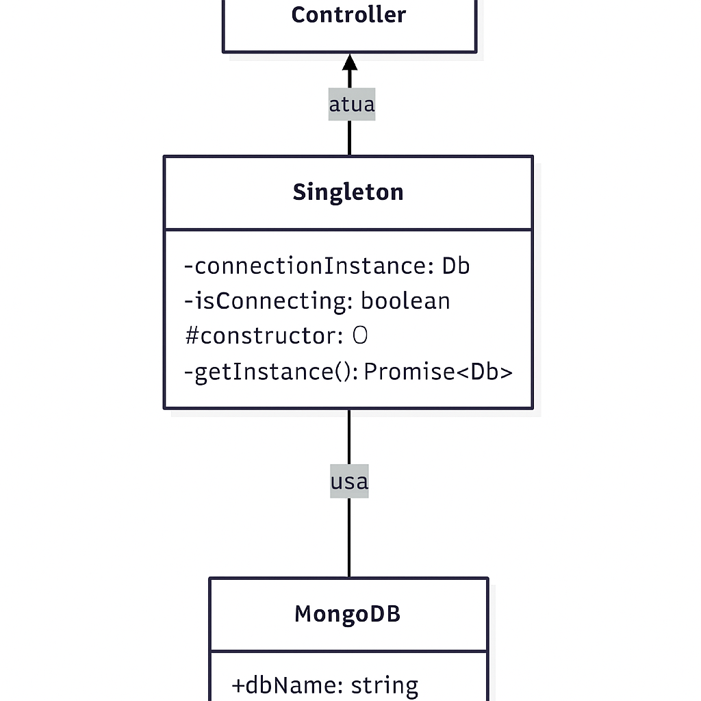

# Singleton

## Introdução

O padrão **Singleton** é um padrão de projeto criacional que garante que uma classe tenha apenas **uma instância** e fornece um **ponto de acesso global** a essa instância. No contexto do projeto "O que planejo fazer", que envolve gerenciamento de tarefas e hábitos, o Singleton é crucial para gerenciar recursos compartilhados e garantir a consistência de dados em toda a aplicação.

### Objetivo

O principal objetivo da aplicação do padrão **Singleton** é assegurar que componentes críticos, que devem operar com um estado global único e consistente, sejam acessados de forma centralizada. Isso é fundamental para manter a integridade dos dados e a coerência do comportamento da aplicação.

As metas fundamentais incluem:

*   **Consistência global:** Garantir que diferentes módulos do sistema, como o front-end, back-end e banco de dados, compartilhem as mesmas configurações, serviços e dados essenciais, prevenindo comportamentos inconsistentes.
*   **Centralização de recursos:** Concentrar funcionalidades como gerenciamento de configurações, conexão com o banco de dados e serviços de autenticação em instâncias únicas, simplificando o acesso e reduzindo o acoplamento entre os módulos.
*   **Rastreabilidade e controle:** Prover um ponto único para monitoramento, auditoria e ajuste de parâmetros, facilitando a manutenção, depuração e evolução do sistema.

### Metodologia

O processo de aplicação do padrão **Singleton** no projeto uma abordagem estruturada e iterativa, desde a compreensão teórica até a implementação prática e integração ao sistema.

#### Identificação dos candidatos ideais

Com base na arquitetura do projeto "O que planejo fazer", foram identificados os seguintes componentes que se beneficiariam do padrão Singleton:

*   **Gerenciador de Conexão com o Banco de Dados (MongoDB):** Para garantir que todas as operações de banco de dados usem uma única conexão, otimizando recursos e evitando múltiplos pools de conexão.
*   **Gerenciador de Configurações (Node.js):** Para carregar e fornecer configurações globais da aplicação (variáveis de ambiente, chaves de API) de forma consistente para todos os módulos do back-end.
*   **Serviço de Autenticação (Node.js/React):** O back-end (Node.js) pode usar um Singleton para gerenciar a lógica de autenticação e tokens, garantindo que as regras de segurança sejam aplicadas de forma uniforme.

### Modelagem



O padrão Singleton garante que exista apenas uma única instância de um componente e fornece um ponto de acesso global a essa instância. No diagrama acima, o bloco "Singleton" direcionando para "MongoDB" representa o SingletonConnection — ou seja, o Controller solicita a conexão ao Singleton, que retorna sempre a mesma instância de conexão com o banco. Isso evita a criação de múltiplas conexões simultâneas, centraliza o gerenciamento da conexão e assegura comportamento consistente entre os componentes que acessam o banco de dados.


### Implementação (Node.js e React)

**Back-end (Node.js - Gerenciador de Conexão MongoDB)**

O projeto utiliza o padrão Singleton para gerenciar a conexão com o MongoDB, garantindo que haja apenas uma instância de conexão ativa em toda a aplicação. 

```javascript
// backend/src/config/database.js
import mongoose from 'mongoose';
import dotenv from 'dotenv';

dotenv.config();

export async function connectDB() {
  try {
    await mongoose.connect(process.env.MONGO_URI, {
      dbName: 'plannerdb',
    });
    console.log('✅ MongoDB connected successfully');
  } catch (error) {
    console.error('❌ MongoDB connection error:', error);
    process.exit(1); // encerra o app se não conectar
  }
}
```

```javascript
// backend/src/config/singletonConnection.js
import { connectDB } from './database.js';

let connectionInstance = null;
let isConnecting = false;

const SingletonConnection = {
  getInstance: async () => {
    if (connectionInstance) return connectionInstance;
    if (isConnecting) {
      return new Promise(resolve => setTimeout(() => resolve(SingletonConnection.getInstance()), 50));
    }
    isConnecting = true;
    connectionInstance = await connectDB(); 
    isConnecting = false;
    return connectionInstance;
  }
};

Object.freeze(SingletonConnection);
export default SingletonConnection;
```

**Front-end (React - exemplo de uso LoginForm.js)**

O LoginForm utiliza a instância Singleton do cliente de API (ou o axios importado diretamente, que em um ambiente de módulo moderno, age como um Singleton) para realizar a chamada de login.

```javascript
// src/components/LoginForm.jsx
import { useState } from 'react';
import axios from 'axios';

function LoginForm({ onLoginSuccess }) {
  const [email, setEmail] = useState('');
  const [password, setPassword] = useState('');
  const [error, setError] = useState('');
  const [loading, setLoading] = useState(false);

  const handleSubmit = async (e) => {
    e.preventDefault();
    setLoading(true);
    setError('');

    try {
      const response = await axios.post('http://localhost:3333/api/login', {
        email,
        password,
      });
      onLoginSuccess(response.data.token);
    } catch (err) {
      setError(err.response?.data?.error || 'Erro ao fazer login.');
    } finally {
      setLoading(false);
    }
  };

  return (
    <form onSubmit={handleSubmit} className="auth-form">
      <h2>Login</h2>
      <input
        type="email"
        placeholder="Email"
        value={email}
        onChange={(e) => setEmail(e.target.value)}
        required
      />
      <input
        type="password"
        placeholder="Senha"
        value={password}
        onChange={(e) => setPassword(e.target.value)}
        required
      />
      {error && <p className="error-message">{error}</p>}
      <button type="submit" disabled={loading}>
        {loading ? 'Entrando...' : 'Entrar'}
      </button>
    </form>
  );
}

export default LoginForm;
```

#### Integração ao sistema

*   **Back-end (Node.js):** O `SingletonConnection` é importado e utilizado em todos os serviços e controladores que precisam interagir com o banco de dados, garantindo que todas as operações usem a mesma conexão.

    ```javascript
    // Exemplo de uso em um serviço ou controlador (backend/src/controllers/AuthController.js)
    import SingletonConnection from '../config/singletonConnection.js';
    // ... (restante do código do AuthController)

    // Dentro de uma função assíncrona, por exemplo:
    async function someFunction() {
      const db = await SingletonConnection.getInstance();
      // Use 'db' para interagir com suas coleções
      // Ex: const usersCollection = db.collection('users');
      // ...
    }
    ```

*   **Front-end (React):** O cliente de API Singleton (api) é importado e utilizado em componentes React (como LoginForm e RegisterForm) para realizar chamadas à API.

### Resultado Final

A aplicação do padrão **Singleton** no projeto "O que planejo fazer" resultou em um sistema mais **eficiente, consistente e fácil de manter**. A centralização da conexão com o banco de dados e do cliente de API eliminou redundâncias, otimizou o uso de recursos e garantiu a uniformidade no acesso a serviços críticos. Isso facilita a evolução futura do projeto, assegurando que os componentes principais operem de forma coesa.

## Vídeo Explicativo

[Vídeo Singleton](https://www.youtube.com/watch?v=TYn4tbX3UKc)

## Justificativa de Uso

*   O **SingletonConnection Singleton** centraliza e otimiza o gerenciamento da conexão com o banco de dados, evitando a sobrecarga de múltiplas conexões e garantindo a consistência das operações de persistência de dados.
*   Para um **Gerenciador de Configurações Singleton** no back-end, ele assegura que todas as partes da aplicação acessem o mesmo conjunto de configurações, o que é vital para a segurança (chaves de API, segredos) e para a consistência do comportamento da aplicação em diferentes ambientes (desenvolvimento, produção).

Esses usos do padrão Singleton são essenciais para o projeto, que lida com dados de usuário e interações em tempo real, garantindo um sistema robusto, eficiente e seguro.

## Histórico de Versões
| Versão | Alteração | Responsável | Data | Revisor |  Detalhes da Revisão | Data da Revisão |
|--------|-----------|-------------|------|---------|----------------------|-----------------|
| 1.0 | documentação geral da página | [Maria Clara](https://github.com/alvezclari) | 23/10/2025 |Nathan Abreu | Corrigindo links |23/10/2025  |
| 1.1 | adicionando front end| [Maria Clara](https://github.com/alvezclari) | 23/10/2025 |Nathan Abreu | Corrigindo links |23/10/2025  |
| 1.2 | Corrigindo e revisando DOCS | [Nathan Abreu](https://github.com/nateejpg) | 23/10/2025 | |  |  |

