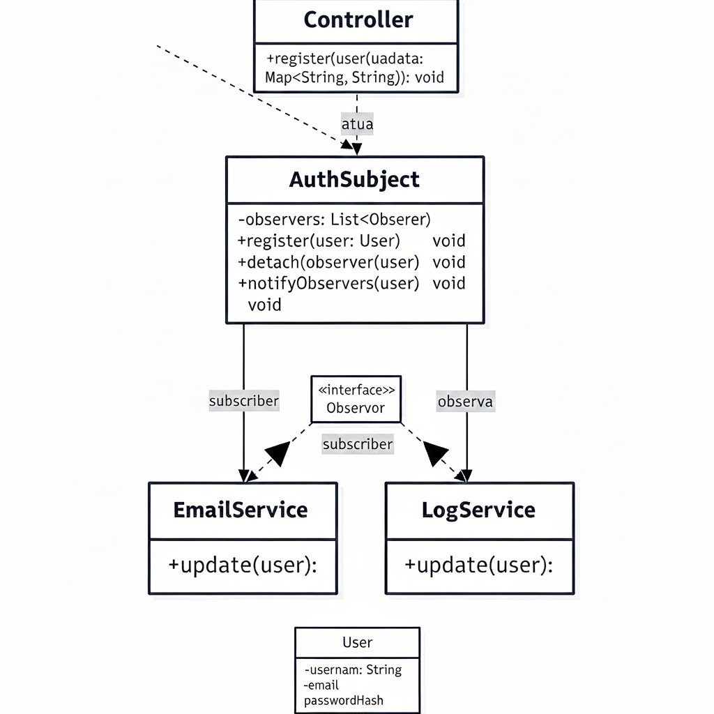

# Observer

## Introdução

O padrão **Observer**, classificado como um padrão comportamental pelo Gang of Four (GoF), define uma dependência um-para-muitos entre objetos, de modo que, quando um objeto muda de estado, todos os seus dependentes são notificados e atualizados automaticamente. No contexto do projeto "O que planejo fazer", este padrão é ideal para gerenciar eventos e notificações, permitindo que diferentes partes da aplicação reajam a mudanças de estado de forma desacoplada.

### Objetivo

O principal objetivo da aplicação do padrão **Observer** é permitir que componentes diferentes da aplicação reajam a eventos específicos (como o registro de um novo usuário) sem que esses componentes estejam diretamente acoplados. Isso promove a flexibilidade, a extensibilidade e a manutenibilidade do sistema.

As metas fundamentais incluem:

*   **Baixo acoplamento:** Reduzir a dependência direta entre os objetos que geram eventos (sujeitos) e os objetos que reagem a eles (observadores), tornando o sistema mais modular.
*   **Extensibilidade:** Facilitar a adição de novos observadores (ex: um serviço de notificação por SMS, um serviço de análise de dados) sem a necessidade de modificar o código do sujeito existente, permitindo que novas funcionalidades de notificação ou reação sejam facilmente incorporadas.
*   **Reatividade:** Permitir que a aplicação responda de forma dinâmica a mudanças de estado importantes, garantindo que as informações relevantes sejam propagadas para todos os interessados em tempo real.
*   **Reutilização de código:** Observadores e sujeitos podem ser reutilizados em diferentes contextos, já que sua interação é definida por uma interface comum.

### Metodologia

O processo de aplicação do padrão **Observer** no projeto seguiu uma abordagem estruturada:

#### Identificação dos candidatos ideais

Com base na arquitetura do projeto "O que planejo fazer", foi identificado o seguinte componente que se beneficiaria do padrão Observer:

*   **Notificações de Registro de Novo Usuário (Back-end Node.js):** Quando um novo usuário se registra na aplicação, diferentes serviços podem precisar ser notificados para realizar ações subsequentes (ex: enviar e-mail de boas-vindas, registrar o evento em um log, integrar com um CRM).

#### Definição do ciclo de vida da instância

O ciclo de vida dos sujeitos e observadores é independente. O sujeito (`AuthSubject`) existe enquanto houver eventos para serem observados. Os observadores (`EmailService`, `LogService`) são instanciados e registrados no sujeito, permanecendo ativos para receber notificações até serem desregistrados ou a aplicação ser encerrada.

#### Planejamento da implementação

Os princípios para a implementação do Observer foram definidos:

*   **Sujeito (Subject):** Define métodos para se inscrever (`subscribe`) e notificar (`notify`) observadores.
*   **Observador (Observer):** Define um método de atualização (`update`) que será chamado pelo sujeito quando ocorrer uma mudança de estado.
*   **Sujeito Concreto (Concrete Subject):** Mantém uma lista de observadores e notifica-os quando seu estado muda (neste caso, o `AuthSubject` ao registrar um novo usuário).
*   **Observador Concreto (Concrete Observer):** Implementa a interface do observador e reage às notificações do sujeito (neste caso, `EmailService` e `LogService`).


### Modelagem



A modelagem visualiza a implementação do padrão Observer no sistema de registro de usuários. Ela é composta pelos seguintes elementos principais:

#### AuthController (O Cliente)
- Classe que inicia o processo
- Porta de entrada do sistema
- Aciona o mecanismo de notificação quando um novo usuário é criado
- Possui dependência com o AuthSubject através de uma relação flexível (linha pontilhada)

#### AuthSubject (O Sujeito)
- Elemento central do padrão
- Mantém uma lista de "observers" (-observers: List<Observer>)
- Fornece métodos para:
  - Gerenciar a lista de observadores (subscribe)
  - Notificar observadores (notify)
- Responsável por distribuir as notificações para todos os inscritos

#### Observer (A Interface)
- Define o contrato que todos os observadores devem seguir
- Especifica o método update(user) que deve ser implementado
- Permite que o AuthSubject notifique qualquer observador de forma padronizada

#### EmailService e LogService (Os Observadores Concretos)
- Classes que implementam a interface Observer
- Cada uma possui sua própria implementação do método update(user)
- Responsabilidades específicas:
  - EmailService: envia e-mails
  - LogService: registra logs
- Mantêm associação direta com o AuthSubject

#### User (O Objeto de Dados)
- Representa a entidade que contém as informações do usuário
- Transmitido do sujeito para os observadores durante as notificações

#### Fluxo de Funcionamento
1. AuthController cria um User
2. AuthController chama notify(user) no AuthSubject
3. AuthSubject percorre sua lista de observers
4. Cada observer (EmailService, LogService) recebe update(user)
5. Os observers executam suas ações específicas independentemente

### Implementação (Node.js)

**Back-end (Node.js - Notificações de Registro de Novo Usuário)**

Este exemplo demonstra como o padrão Observer pode ser usado para notificar diferentes serviços quando um novo usuário é registrado. O `AuthSubject` atua como o Sujeito, e `EmailService` e `LogService` são os Observadores.

```javascript
// backend/src/events/AuthObserver.js
class AuthSubject {
  constructor() {
    this.observers = [];
  }
  subscribe(observer) {
    this.observers.push(observer);
  }
  notify(user) {
    this.observers.forEach(observer => observer.update(user));
  }
}

class EmailService {
  update(user) {
    console.log(`✉️ SIMULAÇÃO: Enviando e-mail de boas-vindas para ${user.email}`);
    // Lógica real para enviar e-mail
  }
}

class LogService {
  update(user) {
    console.log(`📝 LOG: Novo usuário cadastrado com sucesso - ${user.email}`);
    // Lógica real para registrar o evento em um sistema de log
  }
}

const authSubject = new AuthSubject();
authSubject.subscribe(new EmailService());
authSubject.subscribe(new LogService());

export default authSubject;
```
**Front-end (React - Acionamento do Evento)**
No front-end, o componente RegisterForm é o ponto de contato que aciona o evento de registro. Uma vez que a requisição POST é bem-sucedida, o back-end (onde o Observer está implementado) é responsável por notificar os observadores.

```javascript
// src/components/RegisterForm.jsx
import { useState } from 'react';
import axios from 'axios';

function RegisterForm({ onRegisterSuccess }) {
  const [email, setEmail] = useState('');
  const [password, setPassword] = useState('');
  const [error, setError] = useState('');
  const [success, setSuccess] = useState('');
  const [loading, setLoading] = useState(false);

  const handleSubmit = async (e) => {
    e.preventDefault();
    setLoading(true);
    setError('');
    setSuccess('');

    try {
      // Requisição que aciona o Controller no Back-end, que por sua vez, notifica o Observer
      await axios.post('http://localhost:3333/api/register', {
        email,
        password,
      });
      setSuccess('Cadastro realizado com sucesso! Você já pode fazer o login.');
      onRegisterSuccess(); 
    } catch (err) {
      setError(err.response?.data?.error || 'Erro ao cadastrar.');
    } finally {
      setLoading(false);
    }
  };

  // ... (restante do JSX do formulário)
}

export default RegisterForm;
```

**Integração ao sistema**

O `authSubject` é importado no `AuthController` e utilizado após o registro bem-sucedido de um novo usuário para notificar todos os observadores inscritos.

```javascript
// backend/src/controllers/AuthController.js
import User from '../models/User.js';
import authSubject from '../events/AuthObserver.js';
import jwt from 'jsonwebtoken';

class AuthController {
  async register(req, res) {
    try {
      const { email, password } = req.body;
      if (!email || !password) {
        return res.status(400).json({ error: 'Email e senha são obrigatórios.' });
      }
      const newUser = await User.create({ email, password });
      authSubject.notify(newUser); // Notifica os observadores após o registro
      res.status(201).json({ message: 'Usuário cadastrado com sucesso!', user: newUser });
    } catch (error) {
      if (error.code === 11000) {
        return res.status(409).json({ error: 'Este e-mail já está em uso.' });
      }
      res.status(500).json({ error: 'Erro ao registrar usuário.' });
    }
  }

  async login(req, res) {
    // ... (código do login)
  }
}

export default new AuthController();
```
Exemplo de uso no controller (após criar usuário):

```javascript
// ... dentro de AuthController.register
const newUser = await User.create({ email, password });
authSubject.notify(newUser);
res.status(201).json({ message: 'Usuário cadastrado com sucesso!', user: newUser });
```

Como testar (cadastro):
- Rodar o backend (`npm run dev`).
- Executar:

```bash
curl -X POST http://localhost:3333/api/register \
  -H "Content-Type: application/json" \
  -d '{"email":"teste@exemplo.com","password":"senha123"}'
```

Resultados esperados:
- Resposta JSON confirmando criação.
- Mensagens no console vindas do EmailService e LogService.
- Usuário criado na coleção `users` do MongoDB.

---

### Resultado Final

A aplicação do padrão **Observer** no projeto "O que planejo fazer" resultou em um sistema mais **flexível, modular e reativo**. A capacidade de notificar múltiplos componentes sobre o registro de novos usuários sem criar dependências diretas entre eles melhora significativamente a manutenibilidade e a extensibilidade da aplicação. Isso permite que novas funcionalidades, como integração com CRM ou análise de dados de usuário, sejam adicionadas com facilidade, reagindo a eventos existentes sem a necessidade de modificar a lógica central de autenticação.

## Vídeo Explicativo

[Vídeo Observer](https://www.youtube.com/watch?v=S9ws9G3clb0)

## Justificativa de Uso

*   O **Observer para Notificações de Registro de Usuário (Node.js)** permite que diferentes módulos (serviço de e-mail, serviço de log) reajam de forma independente ao evento de registro de um novo usuário. Isso evita que o `AuthController` precise conhecer e chamar diretamente cada um desses serviços, reduzindo o acoplamento e tornando o sistema mais fácil de estender com novas funcionalidades de pós-registro.
*   O padrão Observer é ideal para cenários onde um objeto precisa notificar muitos outros objetos sobre mudanças de estado, mas não quer ter um conhecimento profundo sobre esses objetos. Isso é crucial para construir aplicações escaláveis e de fácil manutenção, onde novas funcionalidades podem ser adicionadas como observadores sem impactar o código existente do sujeito.


## Histórico de Versões
| Versão | Alteração | Responsável | Data | Revisor |  Detalhes da Revisão | Data da Revisão |
|--------|-----------|-------------|------|---------|----------------------|-----------------|
| 1.0 | documentação geral da págiina | [Maria Clara](https://github.com/alvezclari) | 23/10/2025 |Nathan Abreu | Corrigindo links |23/10/2025  |
| 1.1 | adicionando front end| [Maria Clara](https://github.com/alvezclari) | 23/10/2025 |Nathan Abreu | Corrigindo links |23/10/2025  |
| 1.2 | Corrigindo e revisando DOCS | [Nathan Abreu](https://github.com/nateejpg) | 23/10/2025 | |  |  |

