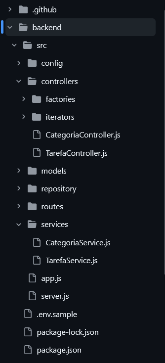
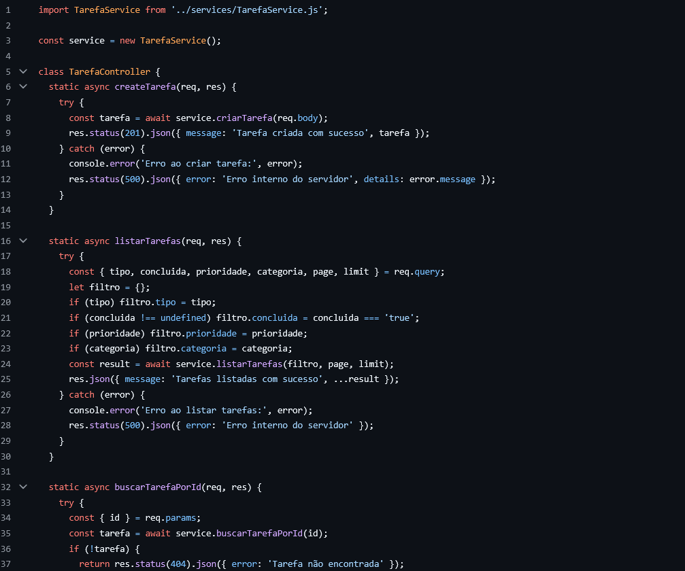
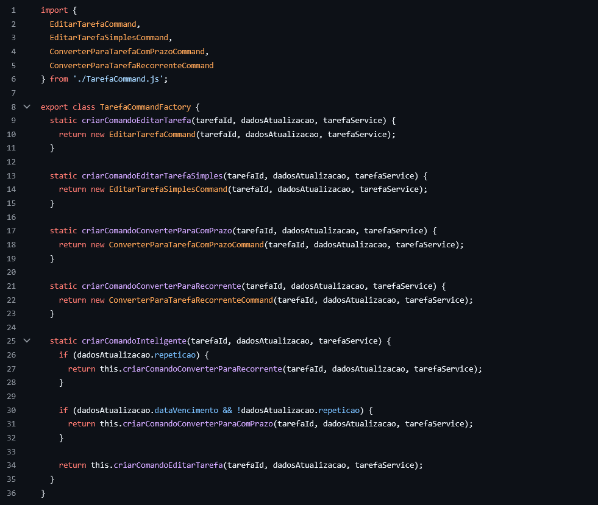

# O Que O Planejo Fazer

**Código da Disciplina**: FGA0208<br>
**Número do Grupo**: 01<br>
**Entrega**: 03<br>

## Alunos
<center> 
  
<table style="width: 100%;">
  <tr>
    <td align="center">
      <a href="https://github.com/Brenno-Silva01">
        <br />
        <sub><b>Brenno Oliveira</b></sub>
      </a>
    </td>
    <td align="center">
      <a href="https://github.com/camilascareli">
        <br />
        <sub><b>Camila Careli</b></sub>
      </a>
    </td>
    <td align="center">
      <a href="https://github.com/DanielCoimbra">
        <br />
        <sub><b>Daniel Coimbra</b></sub>
      </a>
    </td>
    <td align="center">
      <a href="https://github.com/siqueira-prog">
        <br />
        <sub><b>Mateus Siqueira</b></sub>
      </a>
    </td>
    <td align="center">
      <a href="https://github.com/matix0">
        <br />
        <sub><b>Mateus Vinicius</b></sub>
      </a>
    </td>
    <td align="center">
      <a href="https://github.com/mrodrigues14">
        <br />
        <sub><b>Matheus Rodrigues</b></sub>
      </a>
    </td>
    <td align="center">
      <a href="https://github.com/alvezclari">
        <br />
        <sub><b>Maria Clara</b></sub>
      </a>
    </td>
    <td align="center">
      <a href="https://github.com/MillenaQueiroz">
        <br />
        <sub><b>Millena Queiroz</b></sub>
      </a>
    </td>
    <td align="center">
      <a href="https://github.com/nateejpg">
        <br />
        <sub><b>Nathan Abreu</b></sub>
      </a>
    </td>
    <td align="center">
      <a href="https://github.com/yaskisoba">
        <br />
        <sub><b>Yasmin Oliveira</b></sub>
      </a>
    </td>
  </tr>
</table>

</center>

## Sobre 
projeto "O que planejo fazer" tem como objetivo oferecer uma plataforma digital voltada à organização pessoal, permitindo que os usuários criem, classifiquem e gerenciem tarefas e listas de forma prática e eficiente. A aplicação busca unir simplicidade, produtividade e uma base técnica sólida, garantindo uma experiência fluida e confiável.

Nesta etapa do desenvolvimento, foram exploradas e aplicadas as três categorias de padrões de projeto GoF (Gang of Four): **Criacionais**, **Estruturais** e **Comportamentais**.  
O objetivo é aprimorar a arquitetura do sistema, trazendo modularidade, escalabilidade e facilidade de manutenção, além de reforçar boas práticas arquiteturais.

## Screenshots da Segunda Entrega








## Há algo a ser executado?

(X) SIM

( ) NÃO

Antes de começar, confira se você já tem instalado no seu computador:

- [Node.js](https://nodejs.org/) (versão mínima recomendada: 20.19 ou 22.12)
- [npm](https://www.npmjs.com/get-npm) ou [yarn](https://yarnpkg.com/)
- [Git](https://git-scm.com/) (opcional, caso vá clonar o repositório)

### Instalação do Backend (Node.js)

```shell
cd backend
npm install
cp .env.example .env
npm start
```

### Instalação do Frontend (React)

Abra um novo terminal

```shell
cd frontend
npm install
npm run dev
```


## Informações Complementares 
Quaisquer outras informações adicionais podem ser descritas nessa seção.

## Histórico de Versões
| Versão | Alteração | Responsável | Data | Revisor |  Detalhes da Revisão | Data da Revisão |
|--------|-----------|-------------|------|---------|----------------------|-----------------|
| 1.0 | Criação da página | [Brenno Oliveira](https://github.com/Brenno-Silva01) | 23/10/2025 | ---- | ---  | XX/XX/XX |
